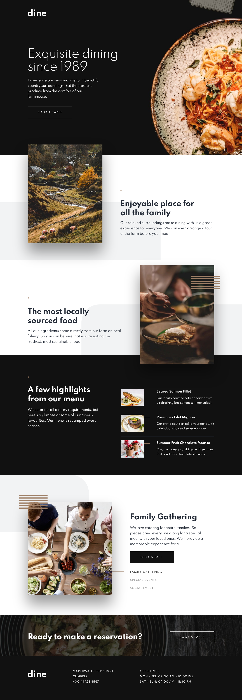
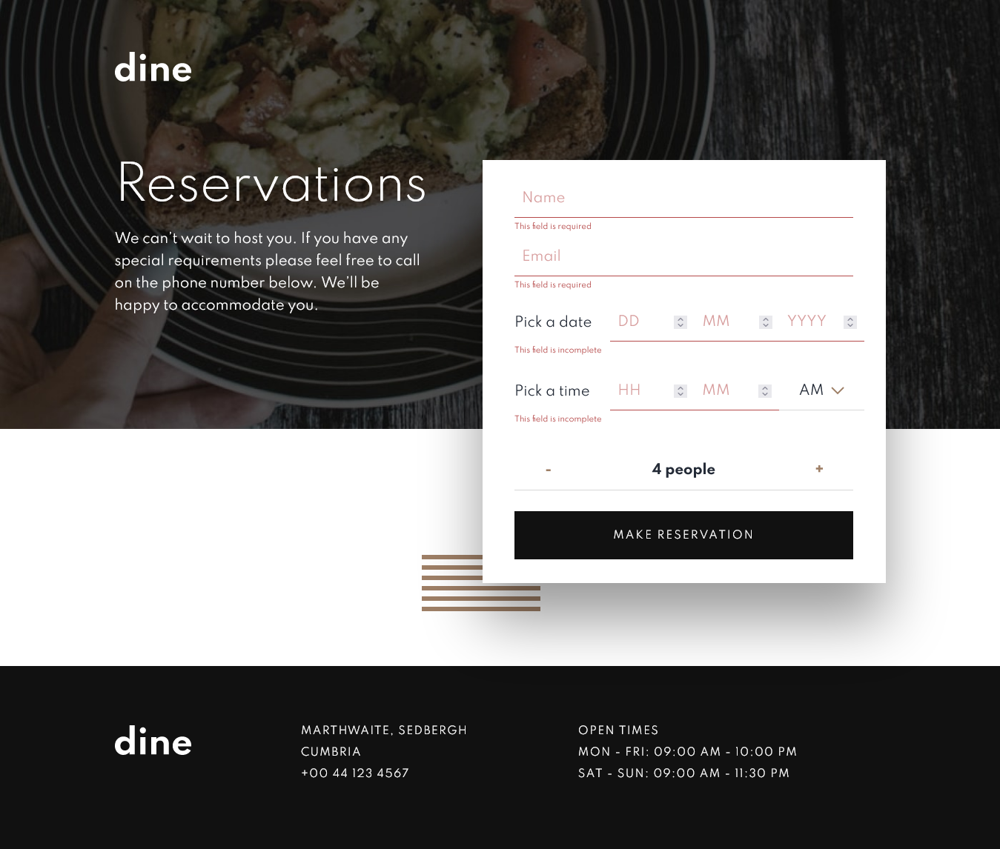

# Dine
This is a two pages website for a restaurant.

The project is actually a challenge from https://frontendmentor.io

The two pages are the home and booking page. Built with HTML, CSS & Javascript.

The form validation on the booking page is made possible with Regular Expressions (RegEx).

## Shots
### Homepage

### Booking Page

### Form Validation

## Live URL
https://dine-website-restaurant.netlify.app/

## Challenge Link
https://www.frontendmentor.io/challenges/dine-restaurant-website-yAt7Vvxt7